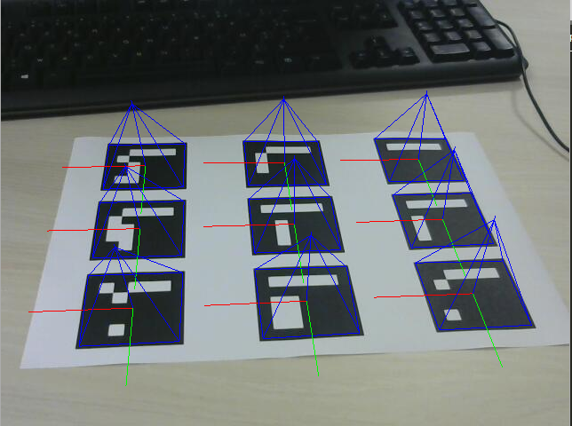
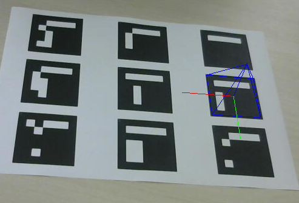

# RV-ArUco

### Etude du comportement de ArUco vis-à-vis des marqueurs
#### Si on présente un ou plusieurs marqueurs
ArUco détecte chacun des marqueurs indépendamment et leur attribut un ID
#### Si un marqueur est plus ou moins visible
ArUco ne détecte le marqueur que si les bords du carré sont entièrement visibles
#### Si l'angle de vue de la caméra est changé
Le changement d'angle de vue n'a pas d'impact sur la détection des marqueurs tant que les bords des carrés restent perceptibles
#### Si la taille des marqueurs change
La taille n'a pas d'impact sur la détection des marqueurs tant que ceux-ci restent suffisammment gros pour être distincts. Avec la feuille de test on va jusqu'à 1m50 avant que ArUco ne détecte plus les marqueurs.

### Première augmentation
#### ArUco-OpenGL

#### Explication de la méthode : ArUco::drawScene()
- Placement dans le repère caméra
- Pour chaque marqueur :  On trace les arrêtes d'un cube (le marqueur est centré sur la face infiérieur du cube)
#### Nouvelle augmentation
Pour cette nouvelle augmentation nous avons décidé de remplacer les cubes par des pyramides
Ci-dessous le code remplaçant la déclaration des cubes:

      glScalef(0.1f,0.1f,0.1f);   
      glPushMatrix();
      glBegin(GL_LINE_LOOP);
         glVertex3f(0.5,-0.5,0.0);
         glVertex3f(0.5,0.5,0.0);
         glVertex3f(-0.5,0.5,0.0);
         glVertex3f(-0.5,-0.5,0.0);
      glEnd();
      //draw the nose
      glBegin(GL_LINES);
         glVertex3f(0.5,-0.5,0.0);
         glVertex3f(0.0,0.0,1);
         glVertex3f(0.5,0.5,0.0);
         glVertex3f(0.0,0.0,1);
         glVertex3f(-0.5,0.5,0.0);
         glVertex3f(0.0,0.0,1);
         glVertex3f(-0.5,-0.5,0.0);
         glVertex3f(0.0,0.0,1);
      glEnd();

 

### Application de réalité augmentée
#### Chasse-Taupe
L'idée du jeu est de copier le jeu "Chasse-Taupe", pour cela on fait apparaître aléatoirement une pyramide sur un des marqueurs
Pour tester le jeu, compiler et lancer [ArUcominimal](https://github.com/GabrielWal/RV-ArUco/tree/dev/arucoMinimal)

Exemple: 

#### Améliorations
Une finalité du jeu serait de faire un compteur de point qui compterait à chaque fois que l'on fait disparaître une pyramide en mettant la main sur le marqueur
