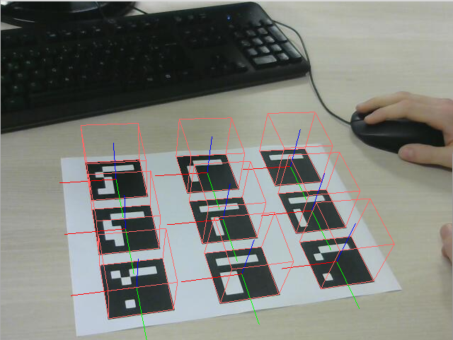

# RV-ArUco

### Etude du comportement de ArUco vis-à-vis des marqueurs
#### Si on présente un ou plusieurs marqueurs
ArUco détecte chacun des marqueurs indépendamment et leur attribut un ID
#### Si un marqueur est plus ou moins visible
ArUco ne détecte le marqueur que si les bords du carré sont entièrement visibles
#### Si l'angle de vue de la caméra est changé
Le changement d'angle de vue n'a pas d'impact sur la détection des marqueurs tant que les bords des carrés restent perceptibles
#### Si la taille des marqueurs change
La taille n'a pas d'impact sur la détection des marqueurs tant que ceux-ci restent suffisammment gros pour être distincts. Avec la feuille de test on va jusqu'à 1m50 avant que ArUco ne détecte plus les marqueurs.

### Première augmentation

